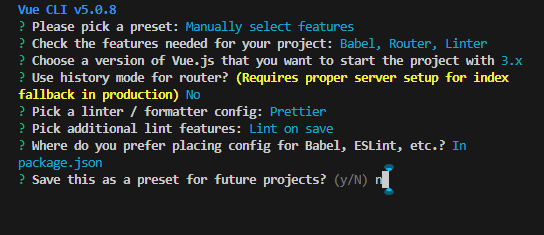

# cops

cops 适合学习vue+go开发

参照：

前端：
webpack+vue3+elemntplus+js

后端：
go+gin+gorm

## 项目开发指南

版本：

1、node版本 18.16.0
2、npm 9.8.1
3、veu cli 5.0.8

注意：
Vue CLI 现已处于维护模式!

现在官方推荐使用 create-vue <https://github.com/vuejs/create-vue>来创建基于 Vite 的新项目。 另外请参考 Vue 3 工具链指南 以了解最新的工具推荐。

创建项目：
vue create cops-fe

🎉  Successfully created project cops-fe.
👉  Get started with the following commands:

 $ cd cops-fe

 $ npm run serve

选项：

